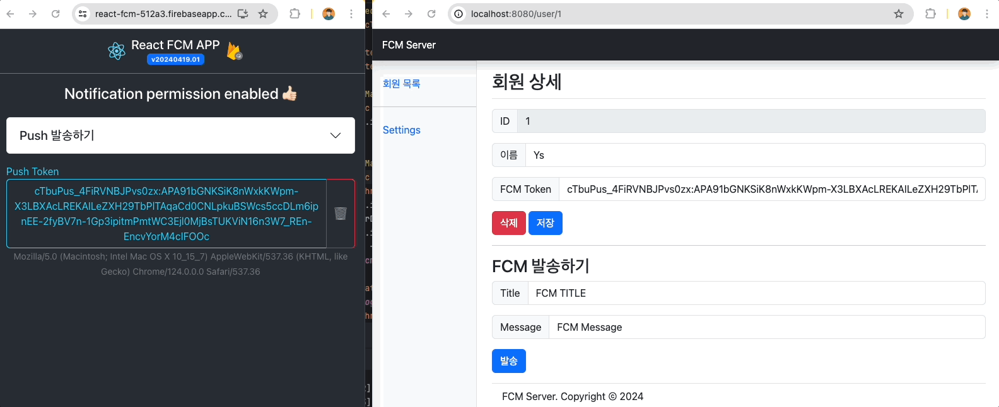

# fcm-v1


> Firebase Cloud Message를 서버 통하여 발송하는 시스템입니다.

## Firebase

1. Firebase Admin Account 다운로드
2. FirebaseApp.initializeApp
3. FCM Token 발급
4. FirebaseMessaging Send

## H2 Database

### H2 실행

```shell
cd ${user}/h2/bin; ./h2.sh 
```

###

### H2 페이지

```text
jdbc:h2:file:${user.dir}/db/H2/data;AUTO_SERVER=true
```


